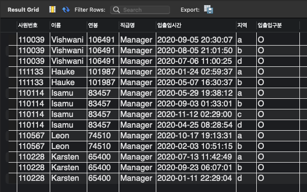
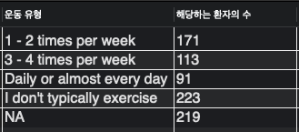

<p align="center">
    
</p>
<p align="center">
  
  
  <a href="https://edu.nextstep.camp/c/R89PYi5H" alt="nextstep atdd">
    
  </a>
  
</p>

<br>

# 인프라공방 샘플 서비스 - 지하철 노선도

<br>

## 🚀 Getting Started

### Install
#### npm 설치
```
cd frontend
npm install
```
> `frontend` 디렉토리에서 수행해야 합니다.

### Usage
#### webpack server 구동
```
npm run dev
```
#### application 구동
```
./gradlew clean build
```
<br>

## 미션

* 미션 진행 후에 아래 질문의 답을 작성하여 PR을 보내주세요.


### 1단계 - 쿼리 최적화

1. 인덱스 설정을 추가하지 않고 아래 요구사항에 대해 1s 이하(M1의 경우 2s)로 반환하도록 쿼리를 작성하세요.

- 활동중인(Active) 부서의 현재 부서관리자 중 연봉 상위 5위안에 드는 사람들이 최근에 각 지역별로 언제 퇴실했는지 조회해보세요. (사원번호, 이름, 연봉, 직급명, 지역, 입출입구분, 입출입시간)

```sql
-- 활동중인(Active) 부서의 현재 부서관리자(manager) 중 연봉 상위 5위안에 드는 사람들이 최근에 각 지역별로 언제 퇴실(O)했는지 조회해보세요.
-- (사원번호, 이름, 연봉, 직급명, 지역, 입출입구분, 입출입시간)
SELECT manager_info.사원번호,
       manager_info.이름,
       manager_info.연봉,
       manager_info.직급명,
       r.time AS 입출입시간,
       r.region AS 지역,
       r.record_symbol AS 입출입구분
  FROM (
        SELECT e.id AS 사원번호, e.last_name AS 이름, s.annual_income AS 연봉, p.position_name AS 직급명
          FROM department d
         INNER JOIN manager m
            ON d.id = m.department_id
         INNER JOIN employee e
            ON m.employee_id = e.id
         INNER JOIN position p
            ON e.id = p.id
         INNER JOIN salary s
            ON e.id = s.id
         WHERE d.note = 'Active'
           AND m.end_date = '9999-01-01'
           AND s.end_date = '9999-01-01'
           AND p.end_date = '9999-01-01'
         ORDER BY s.annual_income DESC
         LIMIT 5
    ) AS manager_info
 INNER JOIN record r
    ON manager_info.사원번호 = r.employee_id
   AND r.record_symbol = 'O'
```


.png)

소요시간: 0.163s

---

### 2단계 - 인덱스 설계

1. 인덱스 적용해보기 실습을 진행해본 과정을 공유해주세요

- Coding as a Hobby
  - 작성한 쿼리
    - ```mysql
      -- Coding as a Hobby
      -- e.g.) Yes 80.8%, No 19.2%
      SELECT hobby,
             CONCAT(ROUND(COUNT(*) / (SELECT COUNT(*) FROM programmer) * 100, 1), '%') as 'percentage'
        FROM programmer
       GROUP BY hobby
       ORDER BY hobby DESC;
      ```
    - Visual 실행계획
      - .png)
    - 
      - 0.420s 소요
  - 인덱스 추가
    - ```sql
      CREATE INDEX `idx_programmer_hobby` ON `subway`.`programmer` (hobby) COMMENT '' ALGORITHM DEFAULT LOCK DEFAULT
      ``` 
    - 실행계획
      - .png)
      - 
    - 0.074s 소요
- 프로그래머별로 해당하는 병원 이름을 반환하세요. (covid.id, hospital.name)
  - 작성한 쿼리
    - ```mysql
      -- 코로나로 입원한 프로그래머의 코로나 정보의 id(covid.id)와 병원 이름(hospital.name)
      SELECT c.id as covid_id,
             h.name as hospital_name
        FROM covid c
       INNER JOIN programmer p ON c.programmer_id = p.id
       INNER JOIN hospital h ON c.hospital_id = h.id;
      ```
    - Visual 실행계획
      - .png)
    - 
    - 0.375s 소요
  - 인덱스 추가
    - ```sql
      ALTER TABLE covid ADD PRIMARY KEY(id);
      ALTER TABLE programmer ADD PRIMARY KEY(id);
      ALTER TABLE hospital ADD PRIMARY KEY(id);
      
      CREATE INDEX idx_covid_programmer_id ON covid (programmer_id);
      ```
    - 실행 계획
      - .png)
      - 
    - 0.0040s 소요
- 프로그래밍이 취미인 학생 혹은 주니어(0-2년)들이 다닌 병원 이름을 반환하고 user.id 기준으로 정렬하세요. (covid.id, hospital.name, user.Hobby, user.DevType, user.YearsCoding)
  - 작성한 쿼리
    - ```mysql
      -- 프로그래밍이 취미인 학생 혹은 주니어(0-2년)들이 다닌 병원 이름을 반환하고 user.id 기준으로 정렬하세요.
      SELECT j.id as programmer_id,
             h.name as hospital_name
        FROM (
              SELECT p.id
                FROM programmer p
               WHERE p.hobby = 'Yes'
                 AND (p.dev_type = 'Student' OR p.years_coding = '0-2 years')
             ) as j
       INNER JOIN covid c ON c.programmer_id = j.id
       INNER JOIN hospital h ON c.hospital_id = h.id
       ORDER BY j.id;
      ```
    - .png)
    - 
    - 0.023s 소요
    - 인덱스 추가 없이 기존 추가된 index 사용
- 서울대병원에 다닌 20대 India 환자들을 병원에 머문 기간별로 집계하세요. (covid.Stay)
  - 작성한 쿼리
    - ```mysql
      -- 서울대병원에 다닌 20대 India 환자들을 병원에 머문 기간별로 집계하세요.
      SELECT c.stay as '머문 기간',
             COUNT(c.stay) as '머문 사람 수'
        FROM covid c
       INNER JOIN hospital h ON c.hospital_id = h.id
       INNER JOIN programmer p ON c.programmer_id = p.id
       INNER JOIN member m ON c.member_id = m.id
       WHERE h.name = '서울대병원'
         AND p.country = 'India'
         AND m.age BETWEEN 20 AND 29
       GROUP BY c.stay;
      ```
    - .png)
    - 
    - 1.356s 소요
  - 인덱스 추가
    - ```sql
      ALTER TABLE member ADD PRIMARY KEY(id);
      CREATE UNIQUE INDEX idx_hospital_name ON hospital (name);
      CREATE INDEX idx_covid_hospital_id ON covid (hospital_id);
      ```
    - 실행 계획
      - .png)
      - 
    - 0.0041s 소요
- 서울대병원에 다닌 30대 환자들을 운동 횟수별로 집계하세요. (user.Exercise)
  - 작성한 쿼리
    - ```mysql
      -- 서울대병원에 다닌 30대 환자들을 운동 횟수별로 집계하세요.
      SELECT p.exercise as '운동 유형',
             COUNT(p.exercise) as '해당하는 환자의 수'
        FROM covid c
       INNER JOIN hospital h ON c.hospital_id = h.id
       INNER JOIN member m ON c.member_id = m.id
       INNER JOIN programmer p ON c.programmer_id = p.id
       WHERE h.name = '서울대병원'
         AND m.age BETWEEN 30 AND 39
       GROUP BY p.exercise;
      ```
    - 실행계획
      - .png)
      - 
    - 
    - 0.0046s 소요
  - 인덱스 추가 없이 기존 추가된 index 사용
---

### 추가 미션

1. 페이징 쿼리를 적용한 API endpoint를 알려주세요
